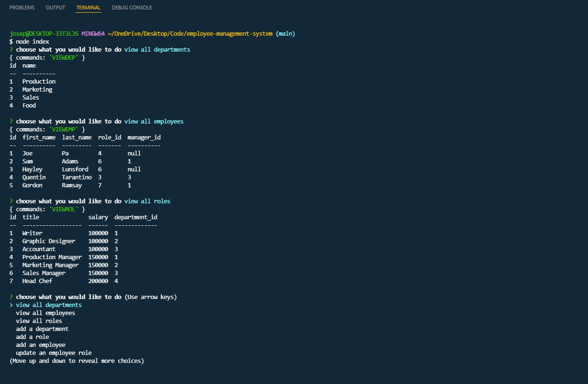

#Employee Management System 

## Table of Contents

- [Link](#link)
- [Description](#description)
- [Installation](#installation)
- [Usage](#usage)
- [Contribution](#Contribution)
- [Liscense](#license)
- [Questions](#questions)

# Link

[](https://drive.google.com/file/d/1NDFLxXlgrtIWWOb2BBVBP_2ZVUjpKu0e/view)

# Description

The purpose of this application is to keep track of employees. Using Node.JS and MySQL, the user can track the departments, roles, and employees. The user can add departments, roles, and employees to their management system to track all of the data needed for their company. In addition, the user can update the roles of their employees in the instance they get a promotion or switch roles.


# Installation

First, make sure you have Node.js installed. [Click here](https://nodejs.org/en/download/) to install Node JS. Then install [Inquirer](https://www.npmjs.com/package/inquirer), [MySQL2](https://www.npmjs.com/package/mysql2) and [Console.table](https://www.npmjs.com/package/console.table). To install the packages, in the console, type

```
npm i
```

# Usage

To start the application, run

```
node index
```

# Contributions

If you wish to contribute, contact me via email at josephpalmisano18@gmail.com

# License

This project's license is MIT.

# Questions

If you have any questions, please contact me using a method below.

## Email

josephpalmisano18@gmail.com

## GitHub Info

[Github](https://github.com/joepamedia/)

### Author

Joe Palmisano
